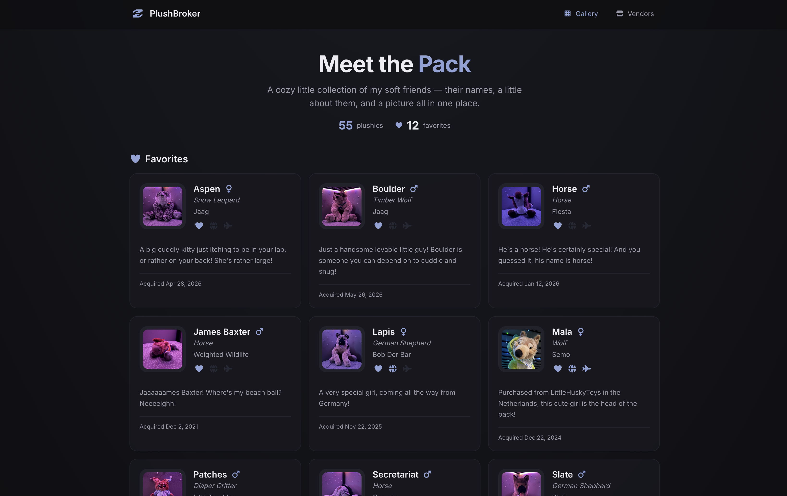

# PlushDB

A cozy catalog for your plushie collection. Built with Next.js, Tailwind CSS, TypeScript, and SQLite.

## Demo

<p align="center">
  
</p>

## Features

- **Public gallery** — browse the collection with favorites highlighted, collection stats, and detail modals for each plushie
- **Vendor directory** — showcase trusted shops and makers on a dedicated `/vendors` page
- **Share links** — share any plushie via a direct URL with Open Graph embeds for Discord, Telegram, and similar apps; native share on mobile, copy-to-clipboard on desktop
- **Manage panel** — add, edit, and delete plushies and vendors (login required)
- **Plushie fields** — name, photo, species, description, manufacturer, date acquired, gender, and trait badges (favorite, imported, travel buddy, well loved, modded, padded)
- **Vendor fields** — name, logo, short description, full description, website, and location
- **Mobile-friendly** — responsive layout with compact icon navigation in the header
- **Dark mode** — easy on the eyes, always on
- **SQLite** — lightweight file-based database stored in `data/`

## Quick Start

```bash
# Install dependencies
npm install

# Copy env and set your credentials
cp .env.example .env

# Initialize the database and admin account
npm run db:init

# Start the dev server
npm run dev
```

Open [http://localhost:3000](http://localhost:3000) for the gallery. Log in at `/login` to manage your collection.

Default credentials (change via `.env` before `db:init`):

| Variable | Default |
|---|---|
| `ADMIN_USERNAME` | `admin` |
| `ADMIN_PASSWORD` | `plushies` |

## Environment Variables

| Variable | Description |
|---|---|
| `ADMIN_USERNAME` | Admin login username (used during `db:init`) |
| `ADMIN_PASSWORD` | Admin login password (used during `db:init`) |
| `SESSION_SECRET` | Secret for session cookies (32+ chars, required in production) |
| `SITE_URL` | Public site URL (e.g. `https://plush.example.com`) used for Discord/Telegram share embeds |

## Scripts

| Command | Description |
|---|---|
| `npm run dev` | Start development server |
| `npm run build` | Production build |
| `npm run start` | Start production server |
| `npm run db:init` | Create database and admin user |

## Tech Stack

- [Next.js 15](https://nextjs.org/) (App Router)
- [Tailwind CSS 4](https://tailwindcss.com/)
- [better-sqlite3](https://github.com/WiseLibs/better-sqlite3)
- [iron-session](https://github.com/vvo/iron-session) for auth

## Data Persistence

Everything you add is saved to disk in the `data/` folder:

| Path | What it stores |
|---|---|
| `data/plushdb.sqlite` | All plushie records and your login account |
| `data/uploads/` | Uploaded photos |

Stopping or restarting the dev server does **not** erase your data. As long as you keep the `data/` folder, your collection persists.

**Back up your collection** by copying the whole `data/` folder somewhere safe.

**Reset everything** by deleting `data/` and running `npm run db:init` again (this wipes plushies, photos, and the admin account).

The `data/` folder is gitignored, so your plushies and photos are never pushed to GitHub unless you copy them elsewhere on purpose.

## Deploy with Docker / Coolify

PlushDB ships with a production `Dockerfile` using Next.js standalone output. SQLite and uploads live in `/app/data` inside the container — **you must mount persistent storage there** or data is lost on redeploy.

### Coolify setup

1. **Create a new resource** → Application → connect your Git repo
2. **Build pack:** Dockerfile (Coolify auto-detects the root `Dockerfile`)
3. **Port:** `3000`
4. **Persistent storage:** add a volume mounted at `/app/data`
5. **Environment variables** (required):

| Variable | Notes |
|---|---|
| `SESSION_SECRET` | Long random string, 32+ characters |
| `ADMIN_PASSWORD` | Login password — set before first deploy |
| `ADMIN_USERNAME` | Optional, defaults to `admin` |
| `SITE_URL` | Optional but recommended — your public HTTPS URL (e.g. `https://plush.example.com`) so share embeds show the correct image/link |

On first start the container runs database initialization automatically and creates the admin account. If the volume already has a database, it skips init.

6. Deploy and open your Coolify-assigned URL

### Local Docker test

```bash
# Create a .env with SESSION_SECRET and ADMIN_PASSWORD set
docker compose up --build
```

Open [http://localhost:3000](http://localhost:3000).

### Backup in production

Copy the `/app/data` volume (or the mounted path on your host) to back up plushies, photos, and login credentials.

### Files added for deployment

| File | Purpose |
|---|---|
| `Dockerfile` | Multi-stage production image |
| `docker-compose.yml` | Local prod test with volume |
| `scripts/entrypoint.sh` | Init DB on start, then run server |
| `scripts/init-db.mjs` | Production DB bootstrap (no dev tooling) |
